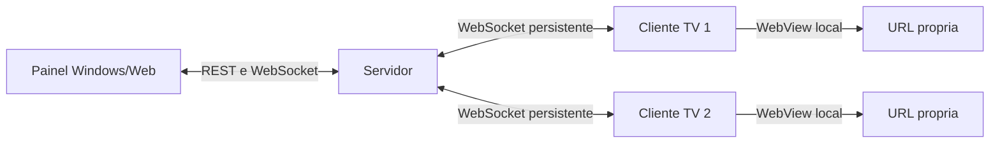

# Arquitetura Tecnica

## Decisao central

Cada TV deve ser um terminal autonomo. O desktop nao transmite tela nem audio; ele apenas coordena estado, comandos e monitoramento. Isso reduz acoplamento, sobrecarga do Windows e fragilidade operacional.

## Componentes

### 1. Backend

Responsabilidades:

- API administrativa REST.
- Canal WebSocket para painel e clientes TV.
- Persistencia inicial em JSON local.
- Controle de heartbeat e marcacao offline.
- Auditoria de comandos e eventos.
- Distribuicao de configuracoes.

No MVP, o backend roda sem dependencias externas para facilitar instalacao. Em producao, a persistencia deve migrar para SQLite ou PostgreSQL.

### 2. Painel desktop/web

Responsabilidades:

- Cadastro de TVs.
- Edicao de URL principal e fallback.
- Visualizacao online/offline.
- Comandos remotos.
- Logs e alertas.

O painel atual e web local. A evolucao natural e embalar com Electron, mantendo o mesmo frontend.

### 3. Cliente Android/Fire TV

Responsabilidades:

- Pareamento por token.
- Renderizacao por WebView.
- Audio local.
- Kiosk/dedicated device quando suportado.
- Boot automatico.
- Wake lock/tela sempre ligada.
- Watchdog com reload leve, recriacao de WebView e reinicio do app.
- Heartbeat e telemetria.

## Fluxo de dados

## Estados principais da TV

- `waiting_activation`: cadastrada, mas ainda nao pareada.
- `online`: enviando heartbeats dentro do limite.
- `offline`: sem heartbeat no prazo.
- `error`: cliente reportou falha critica.

## Politica de recuperacao do cliente

1. Reload leve da URL atual.
2. Recriacao da instancia WebView.
3. Reinicio completo do app.
4. Entrada na URL fallback.
5. Alerta critico no backend.

O cliente deve usar circuit breaker para evitar loop infinito de reinicializacao.
